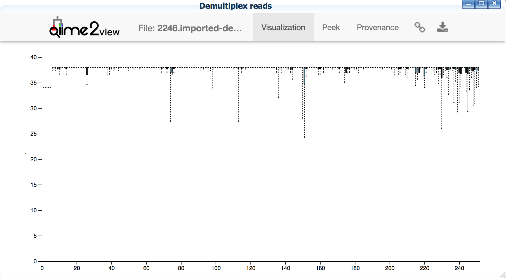
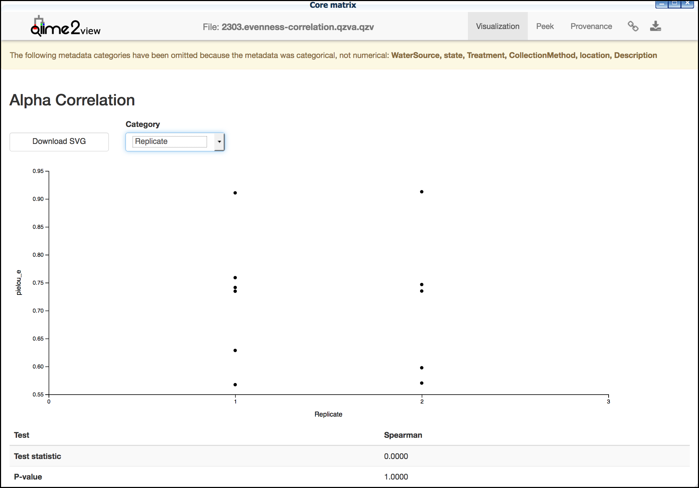
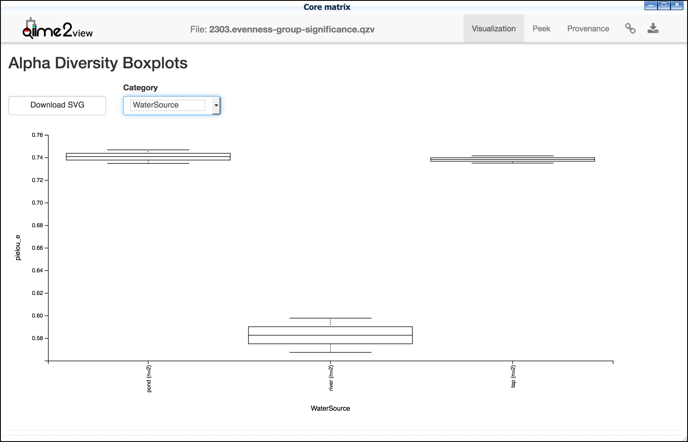
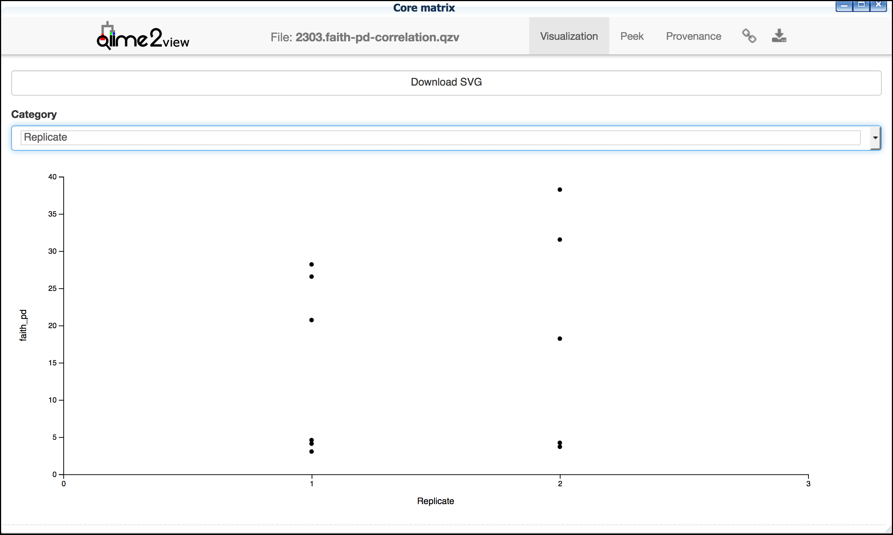
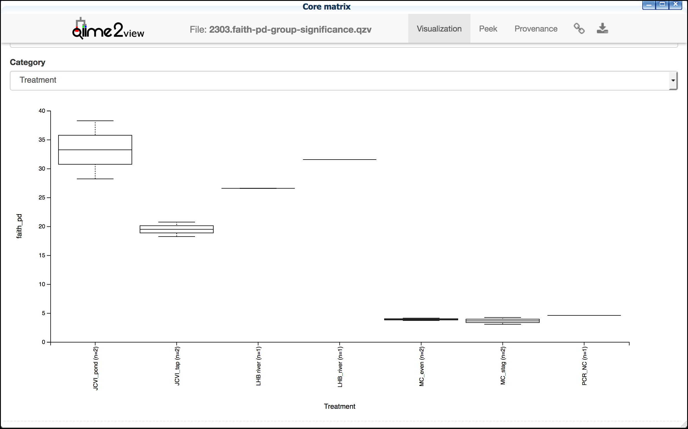
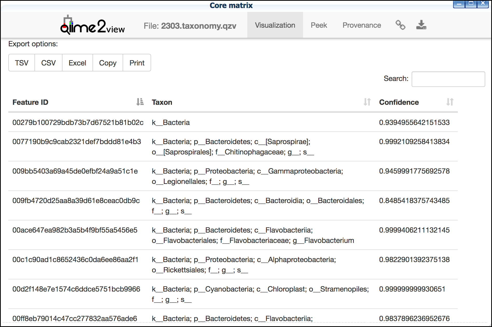

|CyVerse logo|_

|Home_Icon|_
`Learning Center Home <http://learning.cyverse.org/>`_

Walkthrough of DNA Subway Purple Line (alpha testing documentation)
---------------------------------------------------------------------
The Purple Line provides the capability for analysis of microbiome and eDNA
(environmental DNA) by implementing a simplified version of the
`QIIME 2 <https://qiime2.org/>`_ (pronounced "chime two") workflow. Using the
Purple Line, you can analyze uploaded high throughput sequencing reads to get
details on species in microbial or environmental DNA samples.

Metabarcoding uses next generation sequencing to analyze hundreds of thousands
of DNA barcodes from complex mixtures of DNA. In a typical experiment, DNA is
isolated from sterile swabs or material taken from different environmental
locations or conditions. PCR is used to amplify a variable region, such as COI,
or 12S or 16S ribosomal RNA genes, and NGS reads identify the variety and
abundance of species from different samples. The analysis requires specialized
software, such as QIIME 2.

The Purple Line manages data input from Cyverse's Discovery Environment,
metadata upload, demultiplexing of samples, quality control, and taxonomic
identification and quantitation. Once sequences are analyzed, the results can be
visualized to allow comparisons between samples and different conditions
summarized in the metadata.


**Some things to remember about the platform**

- You must be a registered user to use Purple Line. (register for a CyVerse
  account at `user.cyverse.org <https://user.cyverse.org/>`_)
- The Purple line was designed to make microbiome/eDNA data analysis "simple".
  However, we ask that users very carefully and thoughtfully decide what "jobs"
  they want to submit.
- A single Purple Line project may take hours to process since
  HPC computing is subject to queues which may support hundreds of other jobs.
  These systems also undergo regular maintenance and are subject to
  periodic disruption.
- DNA Subway implements the `QIIME 2`_ software. This software is in continual
  development. Our version may not be the most current, and our documentation
  and explanation is not meant to replace the full
  `QIIME2 documentation <https://docs.qiime2.org/2018.2/>`_
- We have made design decisions to create a straightforward classroom-friendly
  workflow. While this Subway Line does not have all possible features of QIIME
  2, we believe the important concepts behind microbiome and eDNA analysis are
  embodied in the current architecture.


----

     .. admonition:: Sample data

       **Sample Data**
      In this guide, we will use a microbiome dataset collected from
      `Montana <http://datacommons.cyverse.org/browse/iplant/home/shared/cyverse_training/platform_guides/dna_subway/purple_line/montana_controls>`_ [MORE INFO]
      Where appropriate, a note (in this orange color backgroud) in the
      instructions will indicate which options to select.


*DNA Subway Purple Line - Metadata file and Sequencing Prerequisites*
~~~~~~~~~~~~~~~~~~~~~~~~~~~~~~~~~~~~~~~~~~~~~~~~~~~~~~~~~~~~~~~~~~~~~~~
For QIIME 2 to run, a valid metadata file is required. This file must conform to
strict guidelines, or analyses will fail. QIIME 2 metadata is stored in a TSV
(tab-separated values) file. These files typically have a .tsv or .txt file
extension, though it doesn't matter to QIIME 2 what file extension is used. TSV
files are simple text files used to store tabular data, and the format is
supported by many types of software, such as editing, importing, and exporting
from spreadsheet programs and databases. Thus, it's usually straightforward to
manipulate QIIME 2 metadata using the software of your choosing. If in doubt,
we recommend using a spreadsheet program such as Microsoft Excel or Google
Sheets to edit and export your metadata files.

.. tip::

  **Leading and trailing whitespace characters**
    If any cell in the metadata contains leading or trailing whitespace
    characters (e.g. spaces, tabs), those characters will be ignored when the
    file is loaded. Thus, leading and trailing whitespace characters are not
    significant, so cells containing the values 'gut' and '  gut  ' are
    equivalent. This rule is applied before any other rules described below

  **ID column**
      The first column MUST be the ID column name (i.e. ID header) and the
      first line of this column should be #SampleID or one of a few alternative.

      - Case-insensitive: id; sampleid; sample id; sample-id; featureid;
        feature id; feature-id.
      - Case-sensitive: #SampleID; #Sample ID; #OTUID; #OTU ID; sample_name

  **Sample IDs**
      For the sample IDs, there are some simple rules so that QIIME 2 does not
      get confused:

      - IDs may consist of any Unicode characters, with the exception that IDs
        must not start with the pound sign (#), as those rows would be
        interpreted as comments and ignored. IDs cannot be empty (i.e. they must
        consist of at least one character).
      - IDs must be unique (exact string matching is performed to detect
        duplicates).
      - At least one ID must be present in the file.
      - IDs cannot use any of the reserved ID column names (the sample ID names,
        above).
      - The ID column can optionally be followed by additional columns defining
        metadata associated with each sample or feature ID. Metadata files are
        not required to have additional metadata columns, so a file containing
        only an ID column is a valid QIIME 2 metadata file.

  **Column names**

      - May consist of any Unicode characters.
      - Cannot be empty (i.e. column names must consist of at least one
        character).
      - Must be unique (exact string matching is performed to detect duplicates)
        .
      - Column names cannot use any of the reserved ID column names.

  **Column values**

      - May consist of any Unicode characters.
      - Empty cells represent missing data. Note that cells consisting solely of
        whitespace characters are also interpreted as missing data.

      QIIME 2 currently supports categorical and numeric metadata columns. By
      default, QIIME 2 will attempt to infer the type of each metadata column:
      if the column consists only of numbers or missing data, the column is
      inferred to be numeric. Otherwise, if the column contains any non-numeric
      values, the column is inferred to be categorical. Missing data (i.e. empty
      cells) are supported in categorical columns as well as numeric columns.
      For more details, and for how to define the nature of the data when needed,
      see the
      `QIIME 2 metadata documentation <https://docs.qiime2.org/2018.2/tutorials/metadata/>`_

**A. Create Metadata file**

  1. Using a spreadsheet editor, create a metadata sheet that provides
     descriptions of the sequencing files used in your experiment. Export this
     file as a tab-delimited **.txt** or **.tsv** file. following
     the `QIIME 2 metadata documentation`_ recommendations.

     .. tip::

        See an example metadata file used for our sample data here:
        `Sample mapping file <http://datacommons.cyverse.org/browse/iplant/home/shared/cyverse_training/platform_guides/dna_subway/purple_line/eDNAworked/mappingfile.tsv>`_


*DNA Subway Purple Line - Create a Microbiome Analysis Project*
~~~~~~~~~~~~~~~~~~~~~~~~~~~~~~~~~~~~~~~~~~~~~~~~~~~~~~~~~~~~~~~~

**A. Create a project in Subway**

  1. Log-in to `DNA Subway <https://dnasubway.cyverse.org/>`_ - unregistered
     users may NOT use Purple Line. (register for a CyVerse account at `user.cyverse.org`_)

  2. For 'Select Project Type' select either Single End Reads or Paired End
     Reads


     .. admonition:: Sample data

        "montana_controls" dataset: select **Single End Reads**


  3. For 'Select File  Format' select the format the corresponds to your sequence metadata.

     .. tip::
         Typically, microbiome/eDNA will be in the form of multiplexed FastQ
         sequences. We support the following formats:

         - `Illumina Casava 1.8 <https://support.illumina.com/content/dam/illumina-support/documents/myillumina/33d66b02-53b5-4f4d-9d8b-f94237c7e44d/casava_qrg_15011197b.pdf>`_
         - `Earth Microbiome Project <http://www.earthmicrobiome.org/protocols-and-standards/>`_


    .. admonition:: Sample data

        "montana_controls" dataset: select **Illumina Casava 1.8**


  4. Enter a project title, and description; click :guilabel:`&Continue`.

**B. Upload Read Data to CyVerse Data Store**

The sequence read files used in these experiments are too large to upload using
the Subway internet interface. You must upload your files (either .fastq or .fastq.gz)
directly to the CyVerse Data Store.

  1. Upload your

     - FASTQ sequence reads
     - Sample metadata file (.tsv or .txt formatted according to `QIIME2 Metadata requirements <https://docs.qiime2.org/2018.2/tutorials/metadata/>`_ )

     to the CyVerse Data Store using Cyberduck. See instructions:
     `CyVerse Data Store Guide <https://cyverse-data-store-guide.readthedocs-hosted.com/en/latest/step1.html>`_


----

*DNA Subway Purple Line - Metadata and QC*
~~~~~~~~~~~~~~~~~~~~~~~~~~~~~~~~~~~~~~~~~~~

**A. Select files using Manage Data**

  1. Click on the “Manage Data” stop: this opens a Data store window prompting
     you to "Select your FASTQ files from the Data Store" (if you are not logged
     in to CyVerse, it will ask you to do so); click the **add data** link.
  2. Select your metadata file: click on the folder that matches your CyVerse
     username and Navigate to the folder where your sequencing files are located.
     click :guilabel:`&Add selected files` to add your metadata file.

    .. admonition:: Sample data

        For sample metadata file in this guide select navigate to:
        Shared Data > cyverse_training > platform_guides > dna_subway >
        purple_line > montana_controls

        Select the **mappingfile_MT_corrected.tsv** and then click
        :guilabel:`&Add selected files`.

  3. To validate the metadata file, click "validate sample mapping file", header
     columns will be displayed. Next click :guilabel:`&Validate`.

  4. To add sequence data, click the "add data" link. Click on the folder that
     matches your CyVerse username and Navigate to the folder where your
     sequencing files are located.

    .. admonition:: Sample data

        For sample sequence date in this guide select navigate to:
        Shared Data > cyverse_training > platform_guides > dna_subway >
        purple_line > montana_controls

        Select all 11 fastq files (they are compressed and will have the
        fastq.gz file extension). Then click :guilabel:`&Add selected files` or
        :guilabel:`&Add all files in this directory` (only files with a
        .fastq.gz extension will be added).

  5. Click the "add data" link to add the sequencing data to your project. Close
     the "Manage data" window, or repeat this step as appropriate until all your
     sequence data files have been added.


  .. warning::
    **Known alpha-version bug**
    After adding data, the next stop (Demultiplex reads) will still be blocked.
    Refresh DNA Subway in your browser to unblock this step.

**B. Demultiplex reads**

At this step, reads will be grouped according to the sample metadata.
This includes separating reads according to their index sequences if this
was not done prior to running the Purple Line. For demultiplexing based on index
sequences, the index sequences must be defined in the metadata file.

  ..note :

    Even if your files were previously demultimplexed (as will generally be
    the case with illumina data) you must still complete this step to have your
    files appropriately associated with metadata.


  1. Click the 'Demultiplex reads' stop, then click :guilabel:`&demux reads` to
     demultiplex your sample reads.

  2. When demultiplexing is complete, you will generate a file (.qzv) click
     this link to view a visualization and statistics on the sequence and
     metadata for this project.


**C. Check sequencing quality and Trim Reads**

It is important to only work with high quality data. This step will generate a
sequence quality histogram which can be used to determine parameter for trimming.

  1. Click the 'Demultiplex reads' stop, then click the results label ending in
     **.qzv** will appear. Click this link to view your results.

      .. note::

         **QIIME2 Visualizations**

        One of the features of QIIME 2 are the variety of visualizations provided
        at several analysis steps. Although this guide will not cover every
        feature of every visualization, here are some important points to note.

         - **QIIME2 View**: DNA Subway uses the QIIME 2 View plugin to display
           visualizations. Like the standalone QIIME 2 software, you can navigate
           menus, and interact with several visualizations. Importantly, many files
           and visualizations can be directly download for your use outside of
           DNA Subway, including in report generation, or in your custom QIIME 2
           analyses. You can view downloaded .qza or .qzv files at
           `https://view.qiime2.org <https://view.qiime2.org>`_


     .. tip::

       **Quality Graphs Explained**

       After demultiplexing, you will be presented with a visualization that
       displays the following tables and graphs:

        **Overview Tab**

       - *Demultiplexed sequence counts summary*: For each of the fastq files
         (each of which may generally correspond to a single sample), you are
         presented with comparative statistics on the number of sequences
         present. This is followed by a histogram that plots number of sequences
         by the number of samples.

       - *Per-sample sequence counts*: These are the actual counts of sequences
         per sample as indicated by the sample names you provided in your
         metadata sheet.

        **Interactive Quality Plot**

        This is an interactive plot that gives you an average quality
        `Phred score <https://en.wikipedia.org/wiki/Phred_quality_score>`_
        (y-axis) by the position along the read (x-axis). This box plot is
        derived from a random sampling of a subset of sequences. The number of
        sequences sampled will be indicated in the plot caption.

  2. Click the "Interactive Quality Plot" tab to view a histogram of sequence
     quality. Use this plot at the tip below to determine a location to trim.

    .. tip::

      **Tips on trimming for sequence quality**

      On the Interactive Quality Plot you are shown an histogram, plotting the
      average quality (X axis)
      `Phred Score`_ vs. the
      position on the read (y axis) in base pairs for a **subsample** of reads.

      **Zooming to determine 3' trim location**

      Click and drag your mouse around a collection of base pair positions you
      wish to examine. Clicking on a given histogram bar will also generate a
      text report and metrics in the table below the chart. Using these metrics,
      you can choose a position to trim on the right side (e.g. 3' end of the
      sequence read). The 5' (left trim) is specific to your choice of primers
      and sequencing adaptors (e.g. the sum of the adaptor sequence you expect
      to be attached to the 5' end of the read). Poor quality metrics will
      generate a table colored in red, and those base positions will also be
      colored red in the histogram. Double-clicking will return the histogram to
      its original level of zoom.

      **Example plots**

      It is important to maximize the length of the reads while minimizing the
      use of low quality base calls. To this end, a good guideline is to trim
      the right end of reads to a length where the 25th percentile is at a
      quality score of 25 or more. However, the length of trimming will depend
      on the quality of the sequence, so you may have to use a lower quality
      threshold to retain enough sequence for informative sequence searches and
      alignments. This may require multiple runs of the analysis to find the
      optimal trim length for your data.

      *Quality drops significantly at base 35*

      |histogram_poor|

      *Improved quality sequence*

      |histogram_good|

  3. Click on the 'Trim reads' stop. Click :guilabel:`&run` and then select
     values for "trimLeft" (the position starting from the left you wish to
     trim) and "TruncLen" (this is the position where reads should be trimmed,
     truncating the 3' end of the read. Reads shorter than this length will
     be discarded). Finally, click the "trim reads" link.

    .. admonition:: Sample data

        Based on the histogram for our sample, we recommend the following
        parameters:

        - **trimLeft: 17** (this is specific to primers and adaptors in this
          experiment)
        - **TruncLen: 200** (this is where low quality sequence begins, in this case
          because our sequence length is lower than the expected read length)

**D. Check Results of Trimming**
Once trimming is complete, the following outputs are expected:

  1. Click on the generated result links to view summary statistics on your
     sequences.

     .. note::

       **QIIME 2 output names**

       Naming of QIIME outputs in Purple Line will often contain a 4-digit
       number corresponding to a job number on the computing system the analysis
       was completed on. In this documentation four octothorpes (####) will be
       used in place of the numbers.

  - **####.table-trim####.qzv**: This file summarizes the dataset
    post-trimming including the number of samples and the number of features
    per sample. The "Interactive Sample Detail" tab contains a sampling depth
    tool that will be used in computation of the core matrix.
  - **####.re-seqs.gzv**: This table contains a listing of features observed in
    the sequence data, as well as the DNA sequence that defines a feature.
    Clicking on the DNA sequence will submit that sequence for BLAST at NCBI in
    a separate browser tab.

  The feature table contains two columns output by DADA2. DADA2 (Divisive
  Amplicon Denoising Algorithm 2) determines what sequences are in the
  samples. DADA2 filters the sequences and identifies probable
  amplification or sequencing errors, filters out chimeric reads, and can
  pair forward and reverse reads to create the best representation of the
  sequences actually found in the samples and eliminating erroneous
  sequences.

    - **Feature ID**: A unique identifier for sequences.
    - **Sequence**: A DNA Sequence associated with each identifier.

  Clicking on any given sequence will initiate at BLAST search on the NCBI
  website. Click "View report" on the BLAST search that opens in a new
  web browser tab to obtain your results. Keep in mind that if your
  sequences are short (due to read length or trimming) many BLAST searches
  may not return significant results.

     .. tip::

       Although the term "feature" can (unfortunately) `have many meanings <https://forum.qiime2.org/t/what-is-a-feature-exactly/2201>`_
       as used by the QIIME2 documentation, unless otherwise noted in this
       documentation it can be thought of as an OTU (`operational taxonomic unit <https://en.wikipedia.org/wiki/Operational_taxonomic_unit>`_);
       another substitution for the word species. OTU is a convenient and common
       terminology for referring to an unclassified or undetermined species.
       Ultimately, we are attempting to identify an organism from a sample of
       DNA which may not be informative enough to reach a definitive conclusion.

----

*DNA Subway Purple Line - Cluster Sequences*
~~~~~~~~~~~~~~~~~~~~~~~~~~~~~~~~~~~~~~~~~~~~~~~

At this step, you can visualize summaries of the data. A feature table will
generate summary statistics, including how many sequences are associated with
each sample.

  1. Click 'Feature table' and then the "Build feature table" link. When
     processed, you will get a link to a visualization file (.qzv). Open this
     file to examine your results. The QIIME 2 view window will also have a link
     to download a FASTA file of your sequences.

  2. Click on 'Phylogenetic diversity' and then click the "Build phylogenetic
     diversity". This will not generate a visualization, but the data will be
     passed on to the next steps.


      .. tip::

        **Choosing sampling depth**


----

*DNA Subway Purple Line - Calculate Alpha and Beta Diversity*
~~~~~~~~~~~~~~~~~~~~~~~~~~~~~~~~~~~~~~~~~~~~~~~~~~~~~~~~~~~~~~~
At this stop, you will examine *Alpha Diversity* (the diversity of species/taxa
present within a single sample) and *Beta Diversity* (a comparison of
species/taxa diversity between two or more samples). Alpha diversity answers the
question - "how many species are in a sample?"; beta diversity answer the
question - "what are the differences in species between samples?".

  .. warning::
    **Known alpha-version bug**
    After computing Core matrix, other diversity steps may be blocked.
    Refresh DNA Subway in your browser to unblock these steps.

**A. Calculate core matrix**

  1. Click on 'Core matrix' and then click the "run" link. Choose a sampling
     depth based upon the "Sampling depth" tool (described in Section D Step 1,
     in the *table-trim####.qzv* output; *Interactive Sample Detail* tab).
     Choose an appropriate classifier (see comments in the tip below) and
     click :guilabel:`&Submit job`.

       .. tip::

         **Choosing Core matrix parameters**

         *Sampling Depth*

         In downstream steps, you will need to choose a sampling depth for your
         sample comparisons. You can choose by examining the table generated at the
         **Trim reads** step. In the *table-trim####.qzv* output,
         *Interactive Sample Detail* tab, use the "Sampling depth" tool
         to explore how many sequences can be sampled during the Core matrix
         computation. As you slide the bar to the right, more sequences are
         sampled, but samples that do not have this many sequences will be
         removed during analysis. The sampling depth affects the  number of
         sequences that will be analyzed for taxonomy in later steps: as the
         sampling depth increases, a greater representation of the sequences
         will be analyzed. However, high sampling depth could
         exclude important samples, so a balance between depth and retaining
         samples in the analysis must be found.

         *Classifier*
         Choose a classifier pertaining to your experiment type. For
         **Microbiome** choose **Grenegenes (16s rRNA)** classifier. For an
         **eDNA** experiment chose **Custom 12s rRNA, take 3** or if you are
         specifically looking for marine fishes you may elect to choose the
         **Mitofish JO** classifier.

    .. admonition:: Sample data

      We recommend the following parameters for the **montana_controls** dataset:

       - **Sampling Depth**: 3000
       - **Classifier**: Grenegenes (16s rRNA)

  2. When complete, you should generate several visualization results including:

     - **####.bray-curtis-emperor.qzv**: Three-dimensional PCoA
       (principle coordinates analysis) plots

       |bray|

     - **####.eveness-correlation.qzva.qzv**: Measure of community evenness using
       correlation tests

       |even_cor|

     - **####.eveness-group-significance.qzv**: Analysis of differences between
       features across group

       |group_sig|

     - **####.faith-pd-correlation.qzv**: Faith Phylogenetic Diversity (a
       measure of community richness) with correlation tests

       |faith|

     - **####.faith-pd-group-significance.qzv**: Faith Phylogenetic Diversity (
       a measure of community richness)

       |faith_group|

     - **####.taxa-bar-plots.qzv**: An interactive stacked bar plot of species
       diversity

       |taxabar|

     - **####.taxononmy.gzv**: A table indicating the identified "features",
       their taxa, and an indication of confidence.

       |taxonomy|

     - **####.unweighted unifrac-emporor.qzv**: unweighted interactive PCoA plot

       |unweighted|

     You can download and interact with any of the available plots.

     .. tip::

       Selecting different taxonomic levels allows you to visualize diversity
       for each sample at different levels (e.g. Kindom, Phylym, Class, etc.)

       |core_matrix|

**B. Calculate Alpha diversity**

  1. Click on the 'Alpha diversity' stop. Then click the "Build alpha diversity"
     link. No visualization will be created.

**C. Calculate Beta diversity**

  1. Click on the 'Beta diversity' stop. Then click the "Build beta diversity"
     link. No visualization will be created.

**D. Calculate Taxonomic diversity**

  1. Click on the 'Taxonomic diversity' stop and click the "Process diversity"
     link. Results generated will include several visualizations:

     - **.taxa-bar-plots.qzv**: An interactive stacked bar plot of species
       diversity.
     - **.taxononmy.gzv**: A table indicating the identified "features",  their
       taxa, and an indication of confidence.
     - **Other expected results**: [MORE INFO]

**E. Calculate differential abundance**

  1. Click on the 'Differential abundance' stop. Then click on the "Submit
     new "Differential abundance" job" link. Choose a metadata category to group
     by, and a level of taxonomy to summarize by. Then click :guilabel:`&submit job`.

    .. admonition:: Sample data

      We recommend the following parameters for the **montana_controls** dataset:

       - **Group data by**: Treatment
       - **Level of taxonomy to summarize**: 3

----

*DNA Subway Purple Line - Visualize data with PiCrust and PhyloSeq*
~~~~~~~~~~~~~~~~~~~~~~~~~~~~~~~~~~~~~~~~~~~~~~~~~~~~~~~~~~~~~~~~~~~~~~

**Under Development**

----


More help and additional information
`````````````````````````````````````

..
    Short description and links to any reading materials

Search for an answer:
    `CyVerse Learning Center <http://learning.cyverse.org>`_ or
    `CyVerse Wiki <https://wiki.cyverse.org>`_

Post your question to the user forum:
    `Ask CyVerse <http://ask.iplantcollaborative.org/questions>`_

----

**Fix or improve this documentation:**

- On Github: `Repo link <https://github.com/CyVerse-learning-materials/dnasubway_guide>`_
- Send feedback: `Tutorials@CyVerse.org <Tutorials@CyVerse.org>`_

----

.. |CyVerse logo| image:: ./img/cyverse_rgb.png
    :width: 500
    :height: 100
.. _CyVerse logo: http://learning.cyverse.org/
.. |Home_Icon| image:: ./img/homeicon.png
    :width: 25
    :height: 25
.. _Home_Icon: http://learning.cyverse.org/
.. |histogram_poor| image:: ./img/dna_subway/histogram_poor.png
   :width: 400
   :height: 250










